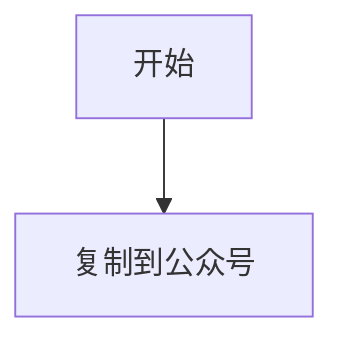

# Obsidian 语法验证

这篇笔记用于验证 wiki link、文档嵌入、callout 和附件提示。

## Wiki Link

普通链接：[[basic]]

带别名：[[embed-note|嵌入说明文档]]

带标题：[[embed-note#目标段落]]

## 文档嵌入

整篇嵌入：

![[embed-note.md]]

标题级嵌入：

![[embed-note.md#目标段落]]

不存在的标题：

![[embed-note.md#不存在的标题]]

## Callout

> [!tip] 发布建议
> 先看右侧“发布前检查”，再复制到公众号。

> [!warning] 图片提醒
> 本地图片当前仍需要手动上传到公众号。

## 本地图片

如果你的 vault 里刚好有一张同名图片，可以把下面的文件名改成真实存在的图片再测：

![[sample-image.png|240|本地图示例]]

## 缺失附件

![[missing-file.png]]

## 不支持语法

$$
E = mc^2
$$
